# Home Lab — Active Directory

Simulação de uma infraestrutura corporativa Windows Server com Active Directory, construída em Hyper-V para praticar administração de TI: promoção de Domain Controller, GPOs, DNS, DHCP, permissões de arquivos e backup do System State.

## Objetivo

Este projeto tem como objetivo reproduzir, em ambiente virtualizado, um cenário real de infraestrutura de TI corporativa, aplicando na prática conceitos de:

- Active Directory Domain Services (AD DS)
- Group Policy Objects (GPO)
- DNS e DHCP
- Permissões NTFS e compartilhamento de arquivos
- Backup do System State com Windows Server Backup

## Topologia

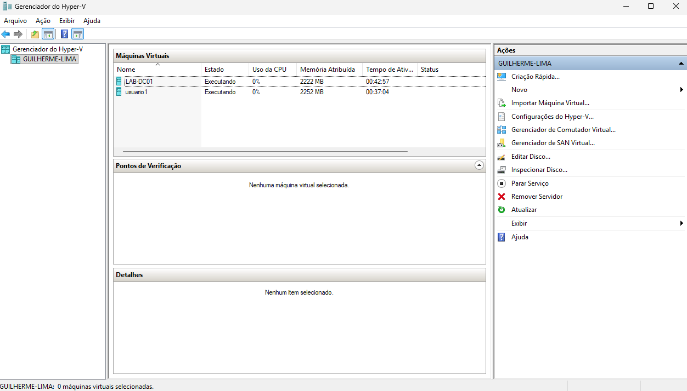

| Máquina  | Função                                   | Sistema Operacional          |
|----------|-------------------------------------------|-------------------------------|
| DC01     | Domain Controller, DNS, DHCP              | Windows Server 2022           |
| usuario1 | Estação cliente ingressada no domínio     | Windows 11 Enterprise (Eval)  |

- **Domínio:** lab.local
- **Rede:** vSwitch interno no Hyper-V, isolando o lab da rede física
- **Faixa de IP:** 192.168.1.0/24 (IP estático no servidor e no cliente)

## Estrutura organizacional (OUs)

Foram criadas Unidades Organizacionais (OUs) simulando departamentos de uma empresa:

```
lab.local
├── TI
├── Financeiro
├── RH
├── Vendas
├── Compras
├── Logistica
├── Diretoria
└── Juridico
```

Cada OU possui usuários e um grupo de segurança correspondente (ex.: grupo `TI` dentro da OU `TI`), usado para controle de acesso a pastas de rede.

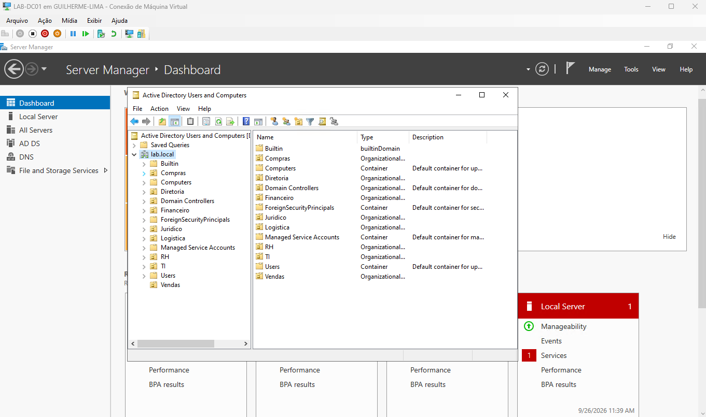
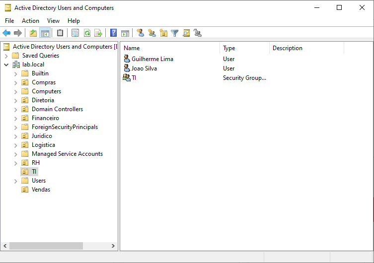

## Etapas realizadas

### 1. Instalação do Windows Server 2022
VM Geração 2 no Hyper-V, com Windows Server 2022 (Desktop Experience), IP estático configurado na interface de rede.

### 2. Promoção a Domain Controller (AD DS)
Instalação da role AD DS e promoção do servidor a controlador de domínio, criando a floresta e o domínio `lab.local`. O próprio DC assumiu o papel de servidor DNS.

### 3. Estrutura de OUs, usuários e grupos
Criação das OUs por departamento, usuários de teste em cada uma, e grupos de segurança (Global, Security) para controle de acesso.

### 4. Ingresso do cliente no domínio
VM Windows 11 Enterprise (Geração 2, com Secure Boot e TPM virtual ativados), configurada na mesma rede do DC, com DNS apontando para o IP do servidor, e ingressada no domínio `lab.local`.

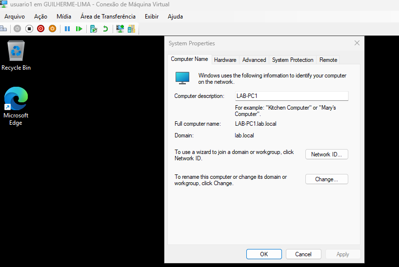
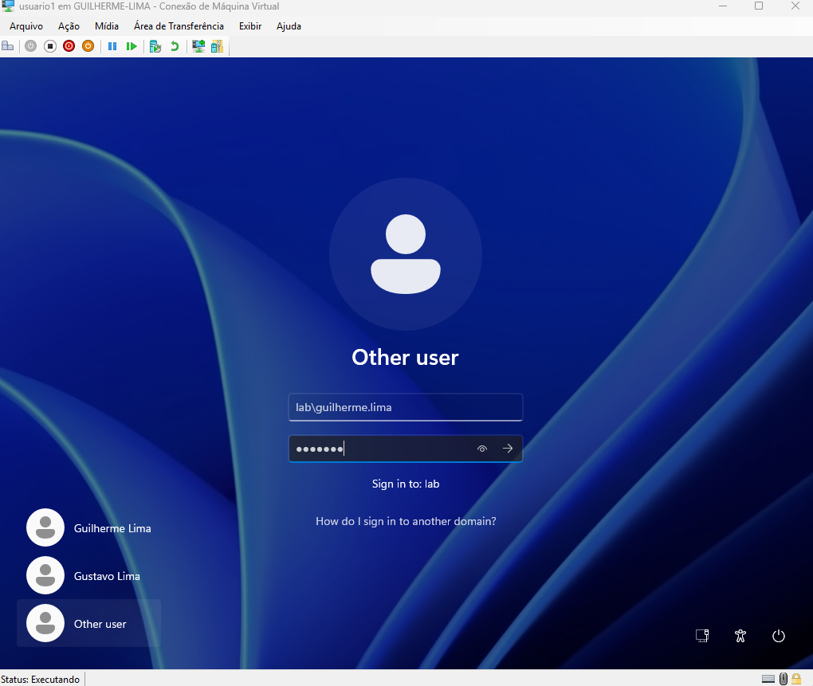

### 5. Compartilhamento de pastas com permissões por grupo
Criação de uma partição de dados com uma pasta por departamento, compartilhada na rede e com permissões NTFS restritas ao grupo de segurança correspondente (ex.: só o grupo `RH` acessa a pasta `RH`).

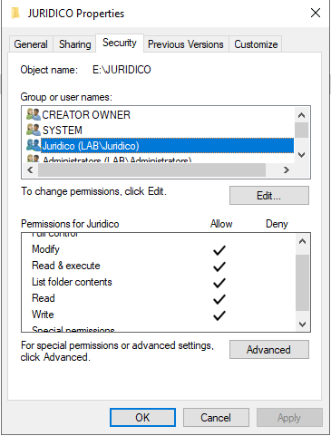
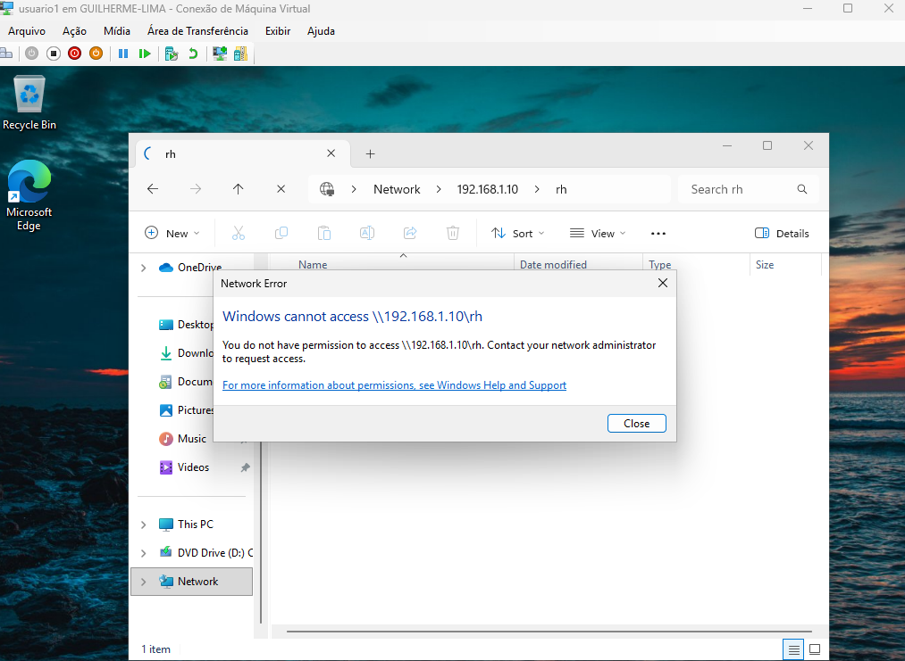

### 6. GPOs implementadas

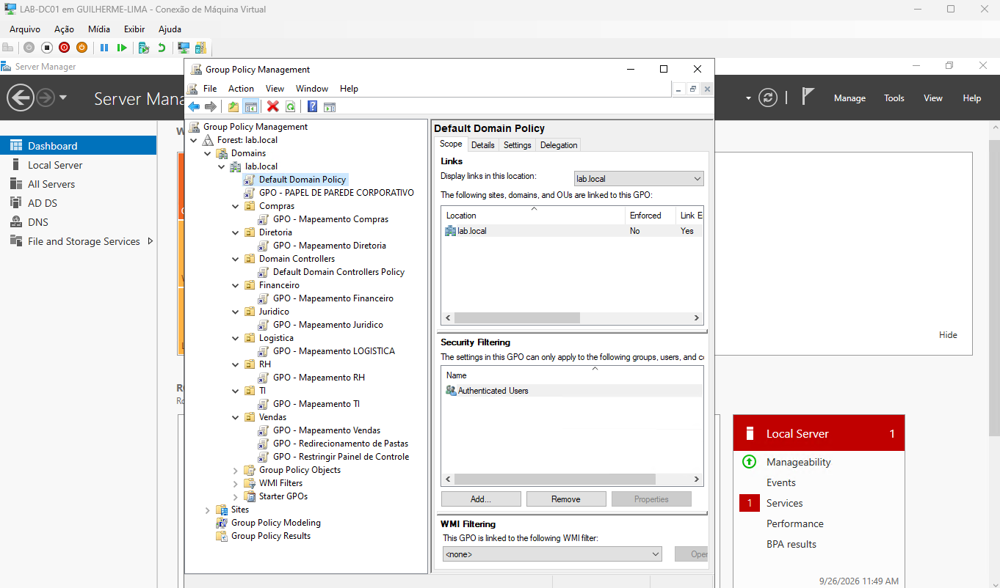

| GPO | Descrição | Escopo |
|-----|-----------|--------|
| Mapeamento de unidade de rede | Mapeia automaticamente a pasta do departamento como unidade de rede no login | Todas as OUs |
| Política de senha | Complexidade, histórico, idade mínima/máxima e bloqueio de conta após tentativas inválidas | Default Domain Policy (todo o domínio) |
| Papel de parede corporativo | Define e trava um papel de parede padrão via GPO | Todo o domínio |
| Restrição de Painel de Controle | Bloqueia acesso ao Painel de Controle e Configurações para usuários comuns | Piloto: OU Vendas |
| Redirecionamento de pastas | Redireciona a pasta Documentos de cada usuário para uma pasta pessoal no servidor | Piloto: OU Vendas |

As GPOs de mapeamento de unidade, política de senha e papel de parede foram aplicadas a todo o domínio. As GPOs de restrição de Painel de Controle e redirecionamento de pastas foram aplicadas inicialmente à OU **Vendas**, como piloto de teste, antes de uma expansão futura para as demais OUs — seguindo a prática de rollout gradual de políticas em ambientes corporativos reais.

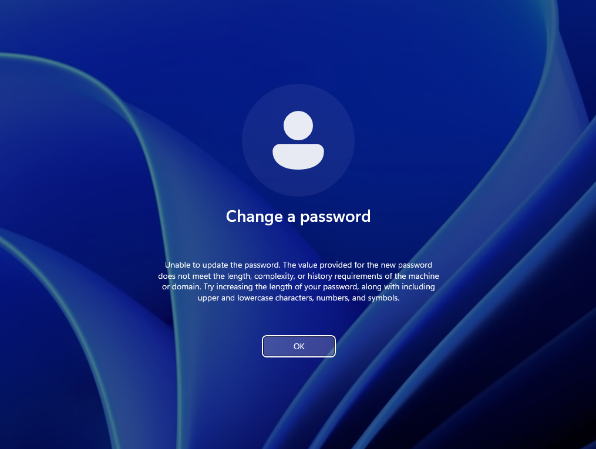
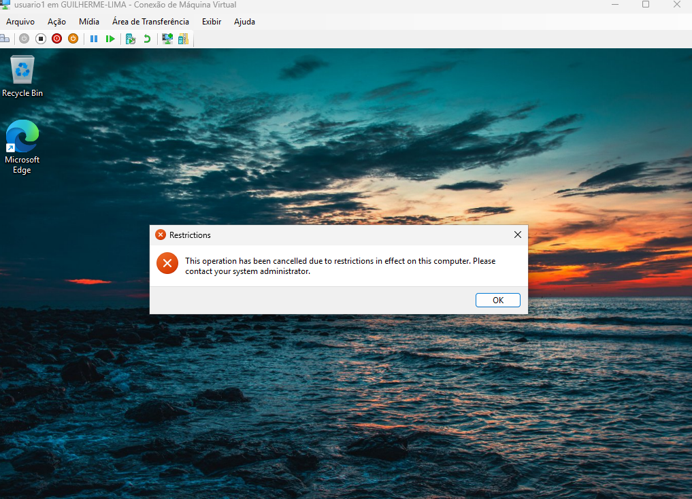
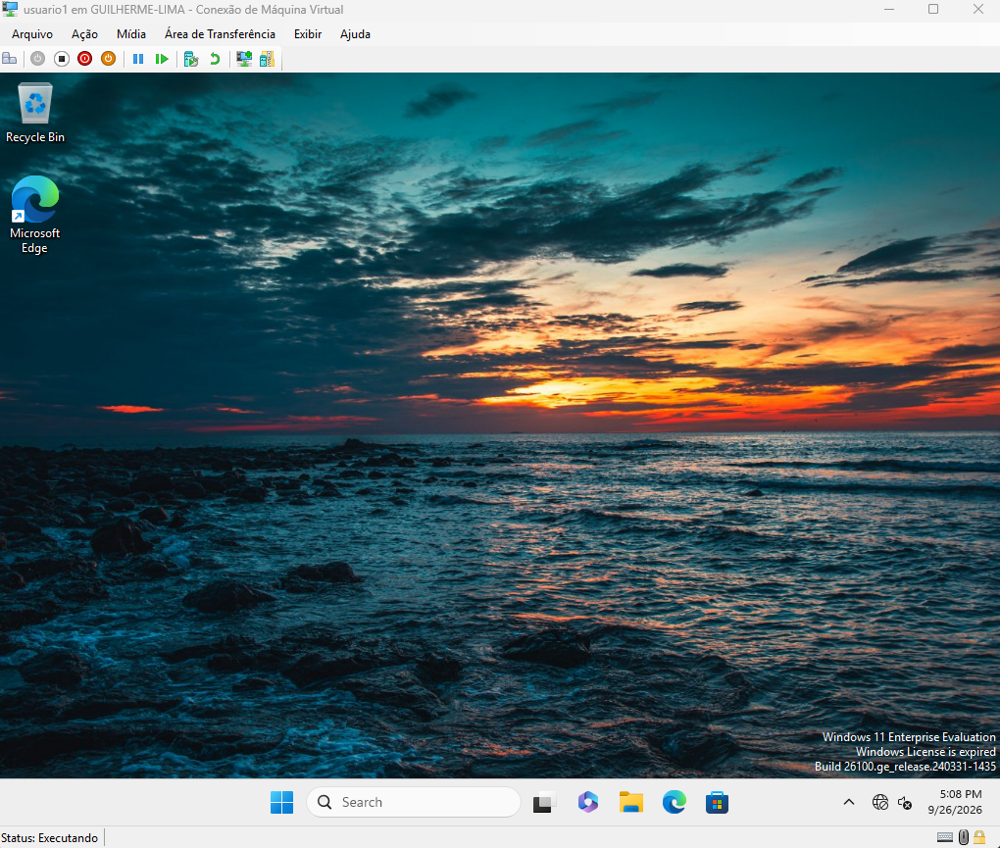
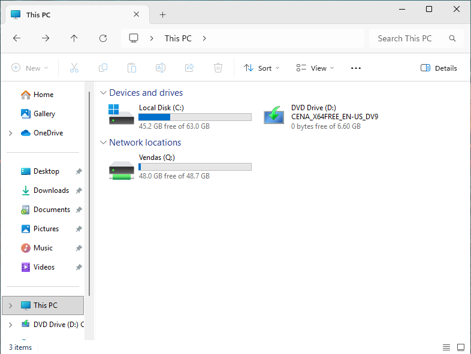
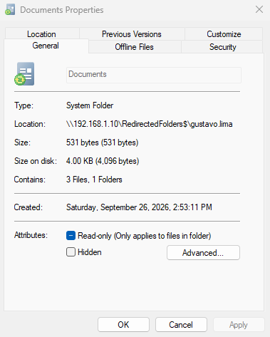

### 7. DHCP Server
Instalação da role DHCP, autorização do servidor no Active Directory e criação de um escopo para a rede do lab (`192.168.1.100` a `192.168.1.200`, máscara `255.255.255.0`), com DNS `192.168.1.10` e domínio `lab.local` distribuídos automaticamente. O cliente foi alterado de IP fixo para automático e recebeu `192.168.1.101` do DC01.

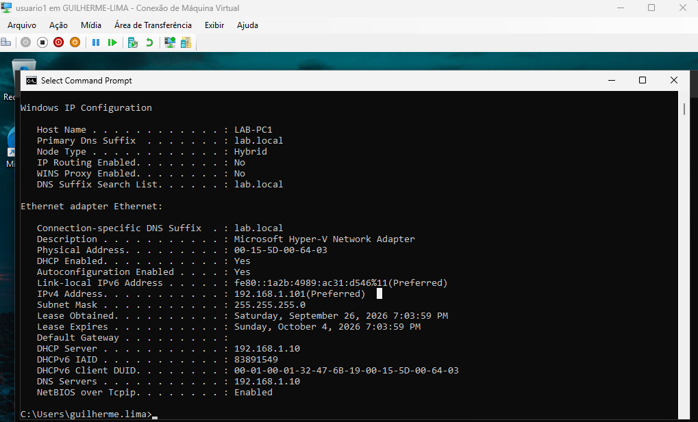

### 8. Backup do System State
Instalação do Windows Server Backup e backup do System State do DC01 (inclui NTDS, SYSVOL e registro) via `wbadmin`.

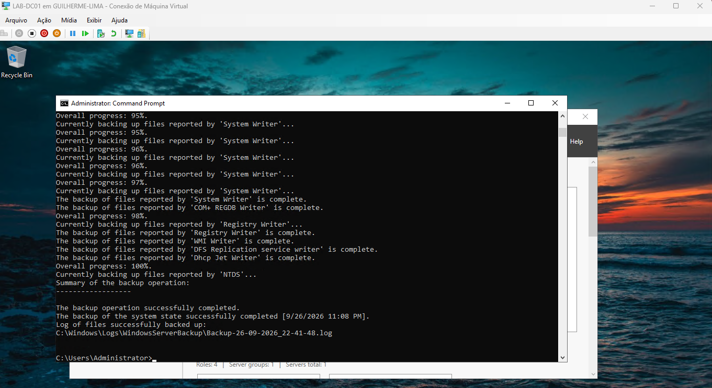

## Desafios e soluções

Esta seção documenta problemas reais encontrados durante o lab e como foram resolvidos — parte importante do processo de aprendizado.

**TPM 2.0 não suportado na instalação do Windows 11**
A VM cliente não passava na checagem de requisitos do instalador. Resolvido ativando **Secure Boot** e **Trusted Platform Module** nas configurações de Segurança da VM no Hyper-V.

**Falha no ingresso ao domínio por DNS**
O cliente não conseguia resolver `lab.local` via `nslookup`. A causa era o DNS do adaptador de rede do cliente não estar configurado. Resolvido apontando o DNS preferencial do cliente para o IP do DC01.

**Papel de parede aplicado pela GPO não aparecia (tela preta)**
Mesmo com a GPO configurada corretamente e o caminho UNC acessível, o papel de parede não era exibido. Causa identificada via `reg query` no Registro: o **Windows Spotlight** estava sobrescrevendo o valor definido pela GPO. Resolvido desativando os recursos de Cloud Content (**Turn off cloud optimized content** e **Turn off Microsoft consumer experiences**) via GPO.

**Erro "Other user" ao logar na VM pelo Hyper-V**
Ao logar com um usuário de domínio pela janela de conexão do Hyper-V, aparecia um erro pedindo permissão de Remote Desktop. Causa: a **Sessão Aprimorada** (Enhanced Session) do Hyper-V usa RDP por trás dos panos. Resolvido desativando a Sessão Aprimorada na janela de conexão da VM.

**Papel de parede corporativo sumia após reinício completo da VM**
A GPO aplicava corretamente logo após `gpupdate /force`, mas falhava depois de um reinício completo do cliente, revertendo para cor sólida preta. Causa: a política de usuário era processada durante o login antes da interface de rede estar totalmente disponível, impedindo o acesso ao caminho UNC da imagem no momento exato da aplicação da política. Resolvido habilitando **"Always wait for the network at computer startup and logon"**, forçando o Windows a aguardar a rede antes de processar as políticas de login.

**Segregação de pastas por departamento não funcionava (qualquer usuário acessava qualquer pasta)**
Mesmo com permissões NTFS configuradas por grupo de segurança, usuários de um departamento conseguiam acessar livremente as pastas de outros. Causa: o grupo interno `Users` do domínio estava herdado da raiz da partição de dados, concedendo acesso de leitura a todos os usuários autenticados em todas as subpastas, independentemente do grupo configurado manualmente. Resolvido desativando a herança de permissões em cada pasta e definindo permissões explícitas (`SYSTEM`, `Administrators` e o grupo do departamento correspondente) via script PowerShell.

## Tecnologias utilizadas

`Hyper-V` `Windows Server 2022` `Active Directory Domain Services` `Group Policy` `DNS` `DHCP` `NTFS Permissions` `PowerShell`

---

Projeto desenvolvido por Guilherme Lima como parte de estudos práticos em administração de infraestrutura Windows.
